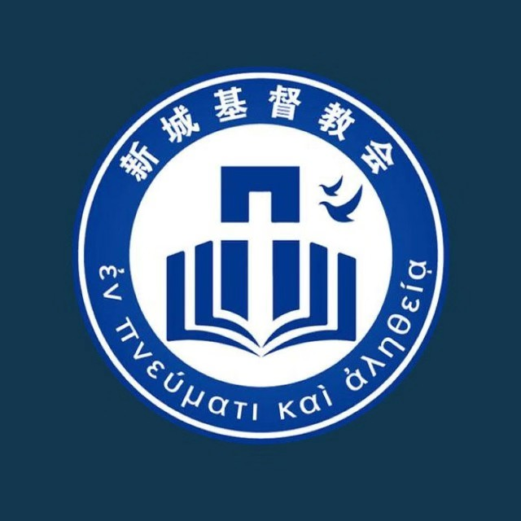

|  | ##新城基督教会 主日证道录音 |
| ------------------------------------------------------------ | ------------------------- |

------

- ### [末日临近当谨慎](https://nccchurch.github.io/211121/)

  - 讲员：赵弟兄
  - 经文：马可福音 13:5~23
  - 日期：2021年11月21日

------

- ### [死里复活的盼望](https://nccchurch.github.io/211114/)

  - 讲员：陈老师
  - 经文：马可福音 12:18~27
  - 日期：2021年11月14日

------

- ### [登山变相与耶稣基督的预言](https://nccchurch.github.io/211107/)

  - 讲员：赵传道
  - 经文：马可福音 9、10章
  - 日期：2021年11月7日

------

- ### [你是基督](https://nccchurch.github.io/211031/)

  - 讲员：薛弟兄
  - 经文：马可福音 8:27~38
  - 日期：2021年10月31日
